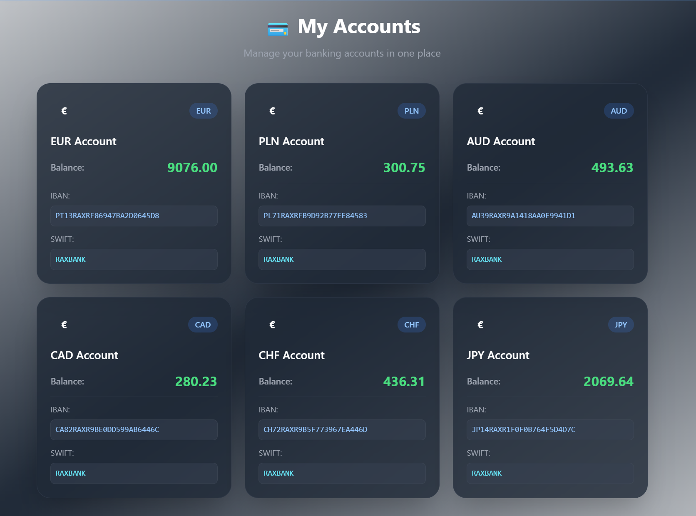
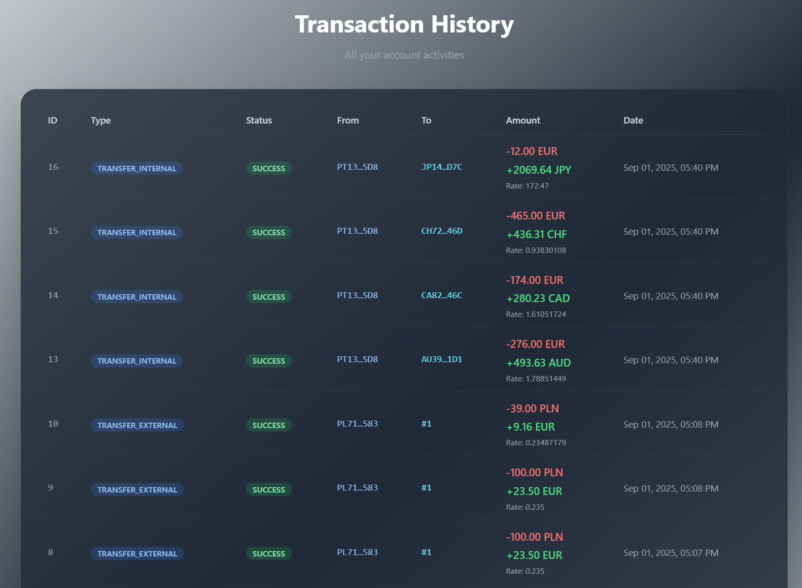
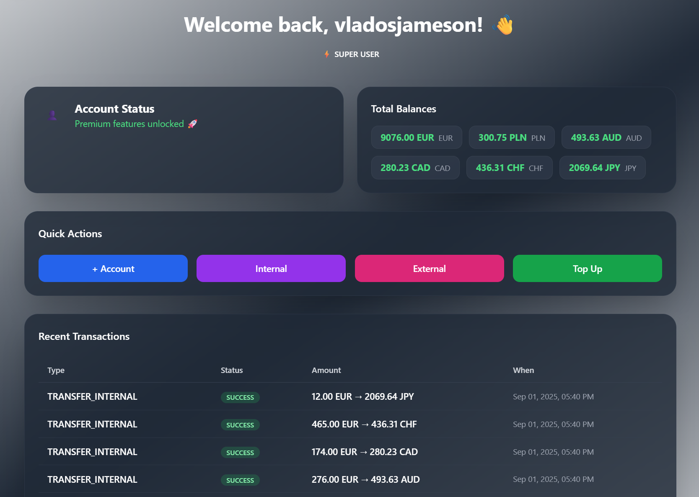
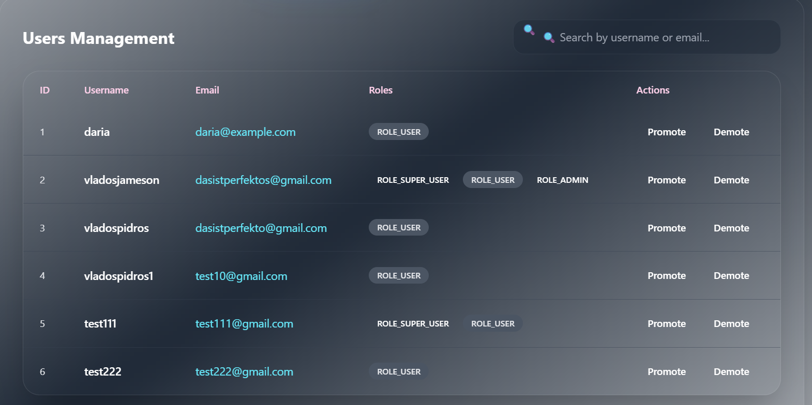
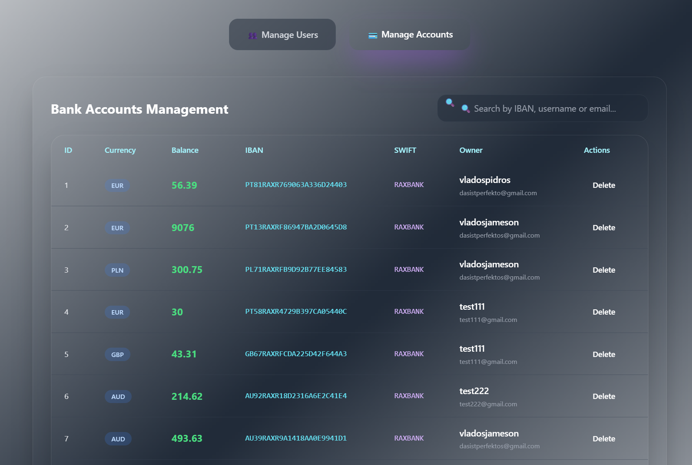
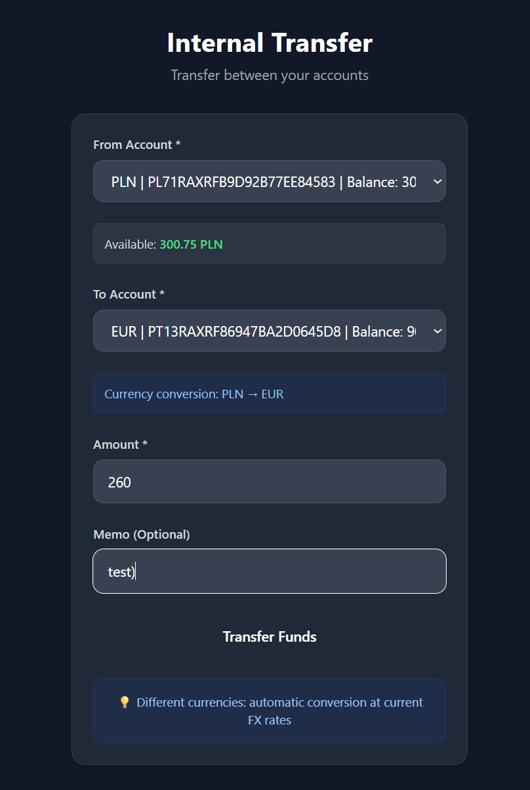

# 🚀 Digital Banking Platform

A modern banking system built with **Spring Boot** that simulates real-world financial operations.  
This project goes far beyond a simple CRUD and demonstrates how enterprise-grade applications are designed.

---

## 📸 Screenshots

### 🏦 My Accounts

### 📜 Transaction History

### 📊 Dashboard

### 💳 Top Up with Stripe

### 👨‍💻 Admin User Management

### 🗂️ Admin Account Management

### 🔄 Internal Transfer

---

## ✨ Key Features

### 🔐 Authentication & Security
- **JWT-based authentication** with refresh logic
- **Role-based access control**: `USER`, `ADMIN`, `SUPER_USER`
- Custom **Auth filters** and **exception handling**

### 👤 User Management
- Register, login, logout
- Change username with **instant JWT refresh**
- Change password with **forced logout**
- Profile picture upload with **AWS S3 integration**
- Username recovery via email reminder

### 🏦 Account Management
- Create/delete accounts in multiple currencies (`EUR`, `USD`, `PLN`, etc.)
- Auto-generated **IBAN** & **SWIFT codes**
- Admin endpoints for account moderation and inspection
- Pagination, sorting, filtering

### 💳 Payments & Top-ups
- Integration with **Stripe Checkout**
- After successful payment, funds are automatically credited to user’s account
- Real-time **currency conversion** via [Frankfurter.app](https://www.frankfurter.app/)

### 🔄 Transfers
- **Internal transfers** between user’s own accounts (with conversion if needed)
- **External transfers** to other users’ accounts
- Automatic **FX rate application** for cross-currency transactions
- Transaction memo support

### 🛒 Premium Features
- Users can **purchase SUPER_USER status** for €20
- Balance is checked and converted automatically
- Role is upgraded seamlessly upon payment

### 📜 Transactions & Statements
- Every operation is logged in the `Transaction` table
- Rich transaction details: type, status, FX rate, memo, references
- Downloadable **account statements** with pagination and sorting
- Separate views for:
    - My transactions
    - Account-specific transactions

### 👨‍💻 Admin Features
- Manage all users (with pagination and roles list)
- Promote/demote users to/from **SUPER_USER**
- Inspect user details along with all their accounts
- Delete accounts or users if needed

### ⚙️ Infrastructure & Best Practices
- **Spring Data JPA** with proper relationships & cascade rules
- **Optimistic locking** with `@Version`
- **ModelMapper** for clean DTO mapping
- **Custom exceptions** with global error handling
- **Validation annotations** on DTOs
- **Clean REST architecture** (Controller → Service → Repository)
- **Swagger/OpenAPI** ready

---

## 🏁 Why This Project Stands Out

This isn’t just another CRUD app. It’s a **mini digital bank**, combining:

✅ **Core banking logic** (accounts, balances, transactions)  
✅ **Payment integration** (Stripe)  
✅ **External API consumption** (currency FX rates)  
✅ **Security & roles** (JWT, ADMIN panel, premium features)  
✅ **Cloud storage** (AWS S3 for profile images)

Perfect for demonstrating **real-world skills** to recruiters and tech leads.

---

🔥 With this project, I don’t just show you can code —  
I show i can **design, secure, and scale a financial system**. 🚀  
